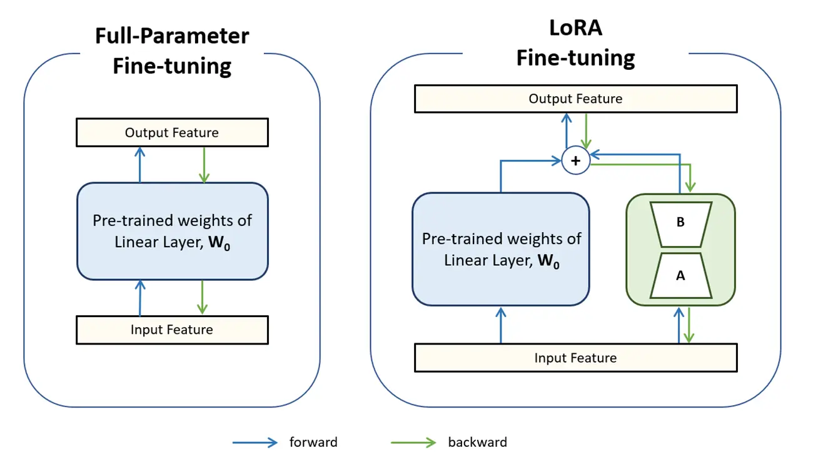

# Activity 1: Fine-Tuning Qwen 2.5 with LoRA

This is the longer reference version of the lab. It keeps the full explanations, alternatives, and appendix material while preserving the working code path used [in the shorter version](./activity1-short-version.md).

The mini project goal is not only to fine-tune a model. You are also expected to:

- adapt the workflow to your own dataset,
- produce structured output,
- and render or expose that output through Gradio.

Because of that, fine-tuning, JSON output, and Gradio should be understood as one connected workflow.

---

## Workflow at a glance

In this lab, you will:

1. prepare the Colab GPU environment,
2. install the required libraries,
3. load the starting model and tokenizer,
4. test the starting model before training,
5. load and format a dataset using the correct chat template,
6. attach LoRA adapters,
7. train the adapters,
8. test the fine-tuned model,
9. produce structured JSON output,
10. connect the result to Gradio,
11. optionally merge the adapter for deployment.

> [!IMPORTANT]
> The most important rule in this lab is consistency. The dataset format, training prompt structure, inference prompt structure, and output format must align.

---

### Prerequisite: Enable GPU in Google Colab

Training language models on a CPU is too slow to be practical. Before starting, you must configure your Colab environment to use a Graphics Processing Unit (GPU).

1. In the top menu, click **Runtime** > **Change runtime type**.
2. Under **Hardware accelerator**, select **T4 GPU**.
3. Click **Save**.

---

## Core workflow

### Step 0: Install Dependencies

Before running any code, you must install the necessary machine learning libraries into your Colab environment. Run this cell first:

```python
# [Cell 0] Install Dependencies
!pip install -q transformers datasets peft accelerate huggingface_hub gradio
```


> [!TIP]  
> To check how much **system RAM (CPU memory)** is available in the container associated with your Colab Jupyter notebook, use this command:
```python
!free -h
````

> Note: This shows only system RAM. To check **GPU memory (VRAM)**, use:

```python
!nvidia-smi
```

> In Colab, you can also view both CPU and GPU resource usage from the menu:
> **Runtime → View resources**


---

### Step 1: Environment Setup and Authentication

Before diving into the code, it is important to note that **a Hugging Face token is not strictly required** to download public models like Qwen. However, if you do not provide one, the Hugging Face library will generate a warning message. Authenticating is a good practice as it suppresses these warnings and is mandatory if you ever decide to use restricted or private models (like Llama 3).

To set this up, add your Hugging Face Access Token to the **Secrets** tab in Google Colab (the key icon on the left sidebar) and name it `HF_TOKEN`. Enable notebook access for this secret.

```python
#[Cell 1] Environment Setup & Authentication
from google.colab import userdata
from huggingface_hub import login
import warnings

# Suppress the specific warning about missing tokens
warnings.filterwarnings("ignore", category=UserWarning, module="huggingface_hub.utils._auth")

try:
    # Attempt to fetch the token from Colab's secure storage
    hf_token = userdata.get('HF_TOKEN')

    # Log into the Hugging Face Hub using the retrieved token
    login(hf_token)
    print("Authentication successful.")
except userdata.SecretNotFoundError:
    # If the token isn't found, smoothly continue without crashing
    print("Notice: HF_TOKEN not found in Colab secrets. Proceeding without authentication.")
```

#### Code Explanation:

*   `from google.colab import userdata`: Imports the specific Google Colab module used to securely access environment variables and API keys stored in the Secrets tab.
*   `from huggingface_hub import login`: Imports the authentication function from the Hugging Face library.
*   `warnings.filterwarnings(...)`: Tells Python to ignore the specific `UserWarning` triggered by the Hugging Face library when it detects an unauthenticated environment.
*   `try...except`: A standard error-handling block. The code "tries" to find the `HF_TOKEN`. If the token is missing, it throws a `SecretNotFoundError`. The `except` block catches this specific error and prints a notice instead of halting the entire notebook.

<details>
<summary><b>Q&A: What exactly is the Hugging Face Hub?</b></summary>
<br>
The Hugging Face Hub is a central repository (similar to GitHub) but specifically designed for machine learning. It hosts models, datasets, and spaces. The `login()` function acts as your digital ID, allowing the code to pull files from the platform under your account.
</details>

<details>
<summary><b>Q&A: Why is it bad to just paste the API key directly into the code?</b></summary>
<br>
Hardcoding sensitive tokens (e.g., <code>login("hf_my_secret_key_123")</code>) is a major security risk. If you share your notebook or push the code to a public repository like GitHub, anyone can use your token to access your private data or consume your API quotas. Using Colab's <code>userdata</code> module keeps the key hidden in the environment.
</details>

---

### Step 2: Load the Starting Model and Tokenizer

**What is a Tokenizer?** Neural networks cannot read text. The tokenizer translates text strings into numerical IDs (tokens) that the model can process mathematically, and later converts the model's numerical output back into human-readable text.

> You can explore how tokenization works in practice using this interactive demo:
[https://platform.openai.com/tokenizer](https://platform.openai.com/tokenizer)


```python
#[Cell 2] Load Model and Tokenizer
from transformers import AutoTokenizer, AutoModelForCausalLM
import torch

model_name = "Qwen/Qwen2.5-1.5B-Instruct"

# 1. Load and configure the Tokenizer
tokenizer = AutoTokenizer.from_pretrained(model_name)
tokenizer.pad_token = tokenizer.eos_token

# 2. Load and configure the Neural Network Model
model = AutoModelForCausalLM.from_pretrained(
    model_name,
    device_map="cuda",
    torch_dtype=torch.float16
)

model.config.use_cache = False
```

> [!NOTE]
> `Qwen/Qwen2.5-1.5B-Instruct` is already an instruction-tuned model, not a raw foundation checkpoint. In this lab, it is the starting model that LoRA adapters are attached to.

#### Code Explanation:

*   `from transformers import AutoTokenizer, AutoModelForCausalLM`: Imports "Auto" classes. Instead of manually finding the specific code class for the Qwen architecture, these factory classes automatically detect the model type from the Hugging Face Hub and load the correct files.
*   `import torch`: Imports PyTorch, the core machine learning library that handles the heavy mathematical tensor operations.
*   `model_name = "Qwen/Qwen2.5-1.5B-Instruct"`: Defines the exact repository path on the Hugging Face Hub.
*   `tokenizer = AutoTokenizer.from_pretrained(...)`: Downloads the tokenizer vocabulary and configuration files.
*   `tokenizer.pad_token = tokenizer.eos_token`: During training, you pass multiple sentences to the model at once (a "batch"). Because sentences have different lengths, the shorter ones must be padded with blank tokens to form a perfect rectangle of data. Qwen does not have a dedicated "blank space" (pad) token, so we tell it to use the "End of Sentence" (`eos_token`) as the filler.
*   `model = AutoModelForCausalLM.from_pretrained(...)`: Downloads the massive mathematical weight matrices of the language model.
*   `device_map="cuda"`: Automatically routes the model weights to the GPU memory (CUDA) instead of the much slower CPU RAM.
*   `torch_dtype=torch.float16`: Loads the model weights using 16-bit floating-point numbers instead of the standard 32-bit. This halves the amount of GPU memory (VRAM) required, allowing the model to fit on a free tier Colab GPU with almost no loss in accuracy.
*   `model.config.use_cache = False`: Disables the "KV Cache." The cache is used during normal chatting to speed up text generation by remembering past tokens. However, during the training phase, this caching mechanism breaks the backpropagation process (how the model learns from errors).

<details>
<summary><b>Q&A: What does "Causal LM" mean in AutoModelForCausalLM?</b></summary>
<br>
"Causal Language Modeling" refers to the specific task of predicting the very next word (token) in a sequence based <i>only</i> on the words that came before it. It is "causal" because the future tokens cannot influence the past ones. This is the underlying architecture for all modern generative AI models like ChatGPT, Llama, and Qwen.
</details>

<details>
<summary><b>Q&A: What happens if I forget to set `device_map="cuda"`?</b></summary>
<br>
If you omit this, PyTorch will default to loading the massive model weights into your system's regular CPU RAM. Attempting to fine-tune a model on a CPU is astronomically slow—what takes minutes on a GPU could take weeks on a CPU.
</details>

<details>
<summary><b>Q&A: Why do we use `torch_dtype` instead of `dtype`?</b></summary>
<br>
In pure PyTorch, you often see <code>dtype</code> used to define data types. However, Hugging Face's <code>from_pretrained()</code> method specifically expects the argument to be named <code>torch_dtype</code>. Using just <code>dtype</code> might be ignored by the function, resulting in the model loading in massive 32-bit precision and crashing your Colab RAM.
</details>

---

### Step 2b: Baseline Inference (Before Fine-Tuning)

Before training, ask the model a target question. Because the starting model has never seen `MediCore.json`, it will likely give a generic or hallucinated answer about MediCore Hospital. This establishes a baseline to prove that fine-tuning changed the model's behavior.

```python
# [Cell 2b] Baseline Inference (Before Fine-Tuning)
messages = [{"role": "user", "content": "Who leads the neurology department at MediCore Hospital?"}]

# Format the prompt
text = tokenizer.apply_chat_template(
    messages,
    tokenize=False,
    add_generation_prompt=True
)

inputs = tokenizer(text, return_tensors="pt").to(model.device)
# print("Token IDs:\n", inputs["input_ids"][0][:20]) # Shows the first ~20 token IDs (numbers)

# Generate an answer using the untrained starting model
output = model.generate(
    **inputs,
    max_new_tokens=50,
    do_sample=False,
    eos_token_id=tokenizer.eos_token_id
)

# Extract and print only the generated response
generated_ids = output[0][inputs.input_ids.shape[1]:]
print("STARTING MODEL ANSWER:\n", tokenizer.decode(generated_ids, skip_special_tokens=True))
```

#### Concept: Understanding Prompt Styles and Chat Templates

Language models do not inherently understand the difference between a human's instruction and their own response. To give them conversational structure, they are trained using specific **control tokens** that define message boundaries and roles.

Different models use entirely different formatting structures:

*   **Llama** models often use `[INST]` and `[/INST]` tags.
*   **Qwen** models utilize a format known as **ChatML**, which relies on tags like `<|im_start|>` to begin a message, `<|im_end|>` to close it, and role indicators like `user` or `assistant`.

If you try to train or prompt a model using the wrong tags (for example, guessing generic tags like `<|user|>` and `<|assistant|>` on a Qwen model), the model treats them as random text rather than structural commands. This causes the model to lose the conversational context, often resulting in runaway text generation or severe hallucinations.

To resolve this across different models, modern workflows use `tokenizer.apply_chat_template()`. This function takes a standardized dictionary of messages and automatically injects the exact control tokens the specific model was trained to recognize.


<details>
<summary><b>Code Explanation:</b></summary>
<br>


**Purpose of this cell**

This is a **baseline test** of your model *before fine-tuning*.

You are asking:

> “What does the model know right now?”

This lets you compare:

* before fine-tuning (this cell)
* after fine-tuning (later)

**Step-by-step explanation**

**1. Define the user message**

```python
messages = [{"role": "user", "content": "Who leads the neurology department at MediCore Hospital?"}]
```

* You create a **chat-style input**
* Format matches how chat models expect data:

  * `"role": "user"`
  * `"content": question`


**2. Format the prompt (Chat template)**

```python
text = tokenizer.apply_chat_template(
    messages,
    tokenize=False,
    add_generation_prompt=True
)
```

What this does:

* Converts structured messages → **single formatted string**
* Adds special tokens required by the model (ChatML format)
* `add_generation_prompt=True` tells the model: “Now it's your turn to answer”

* Example (conceptually):

```
<|user|>
Who leads the neurology department...
<|assistant|>
```

**3. Convert text → tokens (numbers)**

```python
inputs = tokenizer(text, return_tensors="pt").to(model.device)
```

* Text → numerical IDs (tokens)
* Returned as PyTorch tensors (`"pt"`)
* Moved to GPU (`model.device`)

* Models only understand numbers, not text.

**4. Generate output**

```python
output = model.generate(
    **inputs,
    max_new_tokens=50,
    do_sample=False,
    eos_token_id=tokenizer.eos_token_id
)
```

Key parameters:

* `max_new_tokens=50` → limits response length

* `do_sample=False` → deterministic output (same result every time)

* `eos_token_id=...`  → tells model when to stop generating

* This is the **core inference step**


**5. Remove the input from the output**

```python
generated_ids = output[0][inputs.input_ids.shape[1]:]
```

Why this is needed:

* `model.generate()` returns: **[input tokens + generated tokens]**
* This line slices out: only the **newly generated part**

**6. Convert tokens → readable text**

```python
print("STARTING MODEL ANSWER:\n", tokenizer.decode(generated_ids, skip_special_tokens=True))
```

* Converts numbers back → text
* Removes special tokens (like `<|assistant|>`)

**What you should expect**

Since this is **before fine-tuning**, the model will likely:

* hallucinate
* give generic answers
* not know “MediCore Hospital”

**Why this is important**

This gives you a **reference point**.

Later, after fine-tuning, you’ll run the same prompt and compare.


Here’s a simple **visual diagram of the token flow** you can include in your notes or slides:


```
User Input (Text):  "Who leads the neurology department?"

                │
                ▼
Tokenizer (Encoding)
   Converts text → tokens (numbers)

   Example:
   ["Who", "leads", "the", "neuro", "logy", ...]
        ↓
   [1234, 5678, 910, 4321, 8765, ...]

                │
                ▼

Language Model
   Processes token IDs and predicts next tokens

   Input:  [1234, 5678, 910, ...]
   Output: [2222, 3333, 4444, ...]

                │
                ▼

Tokenizer (Decoding)
   Converts tokens → text

   [2222, 3333, 4444] → "The head is Dr. Smith..."

                │
                ▼

Final Output (Text)
   "The head of the neurology department is ???"
```

</details>

---

### Step 3: Load and Preprocess the Dataset

**To get the dataset, you have two options:** You can either manually upload your `MediCore.json` file to the Colab file system (using the folder icon on the left sidebar), or let the code automatically download it for you. This step fetches the data and maps it into the standardized ChatML template.

```python
# Automatically download the dataset if it hasn't been uploaded manually
!wget -nc -q https://github.com/ML-Course-2026/session6/raw/refs/heads/main/material/datasets/MediCore.json
```

*  `-nc` (no-clobber) ensures that if you manually uploaded your own version of `MediCore.json`, the command will not overwrite it.
*  `-q` (quiet) prevents it from printing a messy download progress bar in the Colab output.

```python
#[Cell 3] Dataset Loading and Preprocessing
from datasets import load_dataset

raw_data = load_dataset("json", data_files="MediCore.json")

def preprocess(sample):
    messages = [
        {"role": "user", "content": sample['prompt']},
        {"role": "assistant", "content": sample['completion']}
    ]

    # Automatically applies <|im_start|> and <|im_end|> ChatML tags
    text = tokenizer.apply_chat_template(
        messages,
        tokenize=False,
        add_generation_prompt=False
    )

    tokenized = tokenizer(
        text,
        truncation=True,
        #max_length=256,
        padding=False
    )
    # Explicitly create labels for loss calculation
    #tokenized["labels"] = tokenized["input_ids"].copy()
    return tokenized

data = raw_data.map(
    preprocess,
    remove_columns=raw_data["train"].column_names
)
```

#### Code Explanation:

*   `load_dataset("json", ...)`: Reads your local JSON file and converts it into a highly efficient Hugging Face `Dataset` object.
*   `messages = [...]`: Structures your raw data into a universal dictionary format consisting of "roles" (who is speaking) and "content" (what they are saying).
*   `tokenizer.apply_chat_template(...)`: Takes the generic `messages` list and injects the specific hidden control tokens that Qwen expects (like `<|im_start|>` and `<|im_end|>`).
*   `tokenize=False`: Tells the template function to return a raw text string rather than converting it into numbers immediately. We do the numerical conversion in the very next step.
*   `tokenizer(..., truncation=True, padding=False)`: Converts the correctly formatted text string into numerical IDs. `truncation=True` ensures that if a sentence exceeds the model's maximum context length, the excess is chopped off to prevent crashes.
*   `raw_data.map(...)`: Instead of using a slow `for` loop, `.map()` applies your `preprocess` function to every single row in the dataset simultaneously using optimized C++ backend code.
*   `remove_columns=raw_data["train"].column_names`: Deletes the original human-readable text columns (like `prompt` and `completion`). The neural network only understands the new numerical token IDs, so keeping the text columns would just waste memory.

> [!IMPORTANT]
> This is the main customization point for your own project. In most cases, the most important change is not the model-loading code. It is the dataset mapping in `preprocess(sample)`.

#### If you use your own dataset: exact cells to modify

- The dataset download cell before Cell 3: remove or replace the `wget` command if you are not using `MediCore.json`.
- Cell 2b: replace the baseline question.
- Cell 3: replace the filename and the field mapping inside `preprocess(sample)`.
- Cell 5: adjust training settings if your dataset size or Colab memory budget is different.
- Cell 7: replace the test prompt.
- For the JSON/Gradio part, choose the path that fits your project:
    - Cell 9 if you want to test model-controlled JSON with a system prompt,
    - Cell 10 for the matching Gradio interface for that path,
    - Cell 11 as the recommended default path using a Python-enforced JSON wrapper,
    - Cell 12 if you want a Pydantic-based structured output version.

<details>
<summary><b>Q&A: Why do we use `padding=False` here if the model requires batches of identical length?</b></summary>
<br>
We set <code>padding=False</code> here because we will use <b>Dynamic Padding</b> later. If we padded everything now, every single sentence in the dataset would be padded with thousands of blank tokens to match the absolute longest sentence in the entire dataset, wasting enormous amounts of RAM. Dynamic padding (handled in Step 5) only pads sentences to match the longest sentence <i>in the current tiny batch</i>.
</details>

<details>
<summary><b>Q&A: Why is `add_generation_prompt=False` used during training?</b></summary>
<br>
The generation prompt adds the "assistant's turn to speak" header at the very end of the text. During training, we are showing the model a completed transcript of both the user's question and the assistant's answer, so we do not need a prompt at the end asking the model to generate anything new.
</details>

---

### Step 4: Configure PEFT and LoRA Adapters

**What is PEFT?**
PEFT (Parameter-Efficient Fine-Tuning) is both an umbrella concept and an official Hugging Face library. Instead of updating every single parameter in a massive neural network (which requires supercomputers), PEFT methods freeze the original model and only train a tiny fraction of new parameters. The `peft` library handles all the complex PyTorch code required to do this automatically.

**What is LoRA?** Large Language Models possess billions of parameters. Updating all of them simultaneously (Full Fine-Tuning) requires immense computing power and VRAM. Low-Rank Adaptation (LoRA) is a technique that freezes the original model weights and injects small, trainable "adapter" matrices into specific layers (like the attention mechanism's `q_proj` and `v_proj`). You achieve ~90% of the quality of full fine-tuning while training only ~1% of the parameters. LoRA (Low-Rank Adaptation) is the most popular specific technique *inside* the PEFT library.

```python
# [Cell 4] LoRA Configuration
from peft import LoraConfig, get_peft_model, TaskType

lora_config = LoraConfig(
    task_type=TaskType.CAUSAL_LM,
    r=16,
    lora_alpha=32,
    target_modules=["q_proj", "k_proj", "v_proj", "o_proj", "gate_proj", "up_proj", "down_proj"],
    bias="none"
)

model = get_peft_model(model, lora_config)
```



<br>(src: https://www.intel.com/content/www/us/en/developer/articles/llm/fine-tuning-llama2-70b-and-lora-on-gaudi2.html)

#### Code Explanation:

*   `TaskType.CAUSAL_LM`: Tells the PEFT (Parameter-Efficient Fine-Tuning) library that we are training a model to predict the next word (Causal Language Modeling), as opposed to a classification or translation model.
*   `r=16`: The "rank" of the LoRA matrices. This dictates the "brain capacity" of the adapter. A rank of 8 or 16 is standard. Higher ranks (like 64) can learn more complex patterns but use more VRAM and are prone to overfitting.
*   `lora_alpha=32`: The scaling factor. This dictates how strongly the new LoRA weights influence the original starting model. A standard rule of thumb is to set `alpha` to double the `r` value.
*   `target_modules=[...]`: Specifies exactly which internal mathematical layers of the transformer to attach the adapters to. Targeting all linear layers (Q, K, V, O, and MLP projections) yields vastly superior results compared to just targeting attention layers.
*   `get_peft_model(model, lora_config)`: Wraps the massive, frozen starting model and the tiny, trainable LoRA matrices together into a single manageable object.

<details>
<summary><b>Q&A: What does `bias="none"` mean?</b></summary>
<br>
In neural networks, calculations usually follow the formula <code>y = (weights * input) + bias</code>. Setting <code>bias="none"</code> tells LoRA not to train or modify any bias parameters. This saves memory and keeps the training focused purely on the weight matrices, which is usually sufficient and more stable for LoRA.
</details>

<details>
<summary><b>Q&A: Can we fine-tune a larger model (like 8B) on the Colab Free Tier? (What is QLoRA?)</b></summary>
<br>
With standard LoRA (like we used above), no. The Colab free tier provides 15 GB of VRAM. A 1.5B model takes ~3 GB to load, which fits easily. However, an 8B parameter model (like Llama-3 8B) takes ~15 GB just to load the weights in 16-bit precision, causing an Out of Memory (OOM) crash the moment training starts.
<br><br>
To train larger models for free, you use a technique called <b>QLoRA (Quantized LoRA)</b>. With QLoRA, you use the <code>bitsandbytes</code> library to compress the massive starting model down to 4-bit precision (shrinking an 8B model from ~15 GB down to ~5 GB). The starting model remains frozen in 4-bit, while the PEFT library attaches standard 16-bit LoRA adapters on top. This allows you to fine-tune massive models comfortably within Colab's 15 GB limit.
</details>


<details>
<summary><b>Q&A: How LoRA decides which weights to modify</b></summary>
<br>

Cell #4 does **two important things**:

1. Defines *where* LoRA should be applied
2. Wraps the model so only those parts are trainable

**Key idea**

- LoRA does **not** add layers at the end of the model.
- It **injects small trainable adapters inside specific existing layers**.

**The critical line: `target_modules`**

```python
target_modules=["q_proj", "k_proj", "v_proj", "o_proj", "gate_proj", "up_proj", "down_proj"]
```

- This is what controls **which parts of the model are modified**.

**What these modules are**

These names correspond to components inside each transformer block:

Attention layers

* `q_proj` → Query projection
* `k_proj` → Key projection
* `v_proj` → Value projection
* `o_proj` → Output projection

Feedforward (MLP) layers

* `up_proj`
* `down_proj`
* `gate_proj`

These are **core weight matrices inside every transformer layer**


**What LoRA actually does**

When you run:

```python
model = get_peft_model(model, lora_config)
```

The library:

* Finds all layers matching names like `"q_proj"`, `"v_proj"`, etc.
* Injects **low-rank adapter matrices** into them
* Freezes the original weights
* Makes **only the adapters trainable**

**Important clarification**

**Wrong idea:**

> “LoRA adds something at the end of the model”

**Correct idea:**

> “LoRA modifies specific internal layers throughout the model”

**Visual intuition**

Instead of this:

```
[Transformer] → [LoRA layer at the end]
```

It’s actually this:

```
Layer 1: [q_proj + LoRA] [k_proj + LoRA] ...
Layer 2: [q_proj + LoRA] [k_proj + LoRA] ...
Layer 3: [q_proj + LoRA] [k_proj + LoRA] ...
...
```

LoRA is applied **inside many layers, not after them**

**Why this matters**

* You control **where learning happens**
* You can:

  * adapt attention only
  * adapt MLP only
  * or both (like you did)


**Other config parameters (briefly)**

```python
r=16
```

* Rank of the adapter (size of LoRA matrices)
* Higher = more capacity, more memory

```python
lora_alpha=32
```

Scaling factor for LoRA updates

```python
bias="none"
```

* Bias terms are not trained


**One-line takeaway**

> The `target_modules` field determines **which internal layers get LoRA adapters**, meaning fine-tuning happens *throughout the model*, not at the end.

</details>

---

### Step 5: Configure Training Arguments and Execute Training

**Understanding the Step Count:**
If your output shows a particular number of training steps, that number comes from the size of the training split, the batch settings, gradient accumulation, and the number of epochs.

A useful simplified intuition is:
`Total optimizer steps ≈ (Training Split Size ÷ Effective Batch Size) × Epochs`

In this lab, the exact count depends on all of the following:

- 10% of the dataset is reserved for validation,
- `per_device_train_batch_size=1`,
- `gradient_accumulation_steps=2`,
- `num_train_epochs=5`.

So the exact step count will vary with your dataset size and with how the Trainer rounds partial batches.

```python
#[Cell 5] Training Setup and Execution
from transformers import DataCollatorForLanguageModeling, TrainingArguments, Trainer

# Let the collator handle padding + labels
data_collator = DataCollatorForLanguageModeling(
    tokenizer=tokenizer,
    mlm=False
)

# Split 10% of the data for validation
split = data["train"].train_test_split(test_size=0.1)
train_dataset = split["train"]
eval_dataset = split["test"]

training_args = TrainingArguments(
    output_dir="./results",
    num_train_epochs=5,
    learning_rate=2e-4,

    per_device_train_batch_size=1,      # ↓ reduce to avoid OOM
    gradient_accumulation_steps=2,      # keeps effective batch size

    fp16=True,                          # ↓ big memory saver

    logging_steps=5,
    eval_strategy="epoch",
    lr_scheduler_type="cosine",
    remove_unused_columns=False
)

# IMPORTANT: enable memory savings
model.gradient_checkpointing_enable()

trainer = Trainer(
    model=model,
    args=training_args,
    train_dataset=train_dataset,
    eval_dataset=eval_dataset,
    data_collator=data_collator
)

trainer.train()

trainer.save_model("./my_qwen")
tokenizer.save_pretrained("./my_qwen")
```

#### Code Explanation:

*   `DataCollatorForLanguageModeling`: Acts as the bridge between your dataset and the training loop. It grabs `per_device_train_batch_size` sentences at a time and dynamically pads the shorter one with the `eos_token` so they form a perfect mathematical matrix.
*   `mlm=False`: Disables "Masked Language Modeling". MLM is used by models like BERT to fill in blanks in the middle of sentences. Generative models like Qwen only predict the *next* word, so MLM must be `False`.
*   `num_train_epochs=5`: An "epoch" is one complete pass over your entire dataset. Because LoRA only trains a tiny fraction of the model, and because your dataset is small, you need to show the data to the model multiple times for it to memorize the new facts.
*   `learning_rate=2e-4`: Dictates how large the mathematical adjustments are during training. LoRA adapters initialize with tiny weights, so they require a high learning rate (like `0.0002`) to learn effectively compared to full fine-tuning (which usually uses `0.00002`).
*   `per_device_train_batch_size=1`: Determines how many examples are processed simultaneously. A batch size of 1 or 2 keeps VRAM usage low enough to fit on a free Colab GPU.
*   `Trainer(...)`: The Hugging Face utility that handles all the complex PyTorch training loops, backpropagation, and loss calculations automatically.
*   `trainer.save_model(...)`: This is critical. Because we used PEFT, this command **does not save the massive full starting-model checkpoint**. It only saves the tiny LoRA adapter weights (usually a few megabytes) into the `./my_qwen` folder.
*   `remove_unused_columns=False`: By default, the Hugging Face Trainer automatically deletes any dataset columns that do not directly match the model's expected inputs. Because our mapping function already handled this, setting it to `False` prevents the Trainer from accidentally deleting crucial tokenized data before training starts.
*   `lr_scheduler_type="cosine"`: Slowly reduces the learning rate as training progresses. This prevents the model from taking massive mathematical "steps" near the end of training, helping it settle on the exact correct weights without overshooting.

> [!NOTE]
> The same workflow ran on Google Colab Free Tier without an out-of-memory error when `per_device_train_batch_size=2` was used. In this longer version, `per_device_train_batch_size=1` is kept as the safer default. If your Colab runtime has enough available VRAM, you can try `per_device_train_batch_size=2`.

**NOTE ON OVERFITTING**

This dataset is relatively small, which makes the model prone to overfitting. As a result:

- Training loss will continue to decrease
- Validation loss may start increasing very early (after 1–2 epochs)

This is expected behavior for small datasets. We rely on early stopping or fewer epochs to capture the best model.

<details>
<summary><b>Q&A: Why do we save the tokenizer at the end?</b></summary>
<br>
We save the tokenizer (<code>tokenizer.save_pretrained</code>) alongside the model so that when you load your adapter later, you are guaranteed to be using the exact same vocabulary, special tokens, and ChatML templates that you used during training.
</details>

<details>
<summary><b>Q&A: What is `logging_steps=5`?</b></summary>
<br>
This tells the Trainer how often to print the training loss (how wrong the model's current predictions are) to the screen. If set to 25, it prints an update every 25 steps. Seeing the loss slowly decrease over time proves the model is actually learning.
</details>


<details>
<summary><b>NOTE ON SAVING YOUR MODEL (IMPORTANT IN COLAB)</b></summary>


Colab sessions are temporary. If you do not download your model,
it will be lost when the session ends. After training, we save the LoRA adapters (and tokenizer) to a folder. You should then zip this folder and download it to your local machine.

```python
# Zip the saved folder. This creates a downloadable archive
!zip -r my_qwen.zip my_qwen

# Download to your local machine. 
from google.colab import files
files.download("my_qwen.zip")
```

</details>

---

### Step 6: Load the Fine-Tuned Model

Once training is complete, the LoRA adapters must be loaded alongside the starting model. This cell simulates what you would do if you restarted your Colab notebook and wanted to load your saved work.

> [!NOTE]
> If you have NOT restarted your runtime, skip this step. Your model is already in memory from Step 5.

```python
# [Cell 6] Load Model for Testing
from peft import PeftModel, PeftConfig

path = "./my_qwen"
config = PeftConfig.from_pretrained(path)

# 1. Load the original starting-model checkpoint
base_model = AutoModelForCausalLM.from_pretrained(
    config.base_model_name_or_path,
    device_map="cuda",
    torch_dtype=torch.float16
)

# 2. Attach your tiny, fine-tuned adapter to the starting model
model = PeftModel.from_pretrained(base_model, path)

# 3. Re-enable caching for faster inference speeds
model.config.use_cache = True
```

#### Code Explanation:

*   `PeftConfig.from_pretrained(path)`: Reads the configuration file saved in your `./my_qwen` folder to determine exactly which starting model (e.g., `Qwen2.5-1.5B`) these adapters were trained on.
*   `AutoModelForCausalLM.from_pretrained(...)`: Reloads the massive original model parameters into GPU memory.
*   `PeftModel.from_pretrained(base_model, path)`: This is the magic of LoRA. It takes the heavy starting model and dynamically "snaps on" your tiny, fine-tuned adapter matrices.
*   `model.config.use_cache = True`: During training (Step 2), we disabled the KV Cache because it interferes with backpropagation. Now that we are purely generating text (inference), we turn it back on to drastically speed up response times.

<details>
<summary><b>Q&A: Why do we have to load the starting model again? Why didn't `trainer.save_model` save everything?</b></summary>
<br>
Because we used LoRA, <code>trainer.save_model</code> only saved the tiny adapter weights (the "diff" or changes learned during training), which are usually just a few megabytes. It does not duplicate the full starting-model checkpoint to save disk space. Therefore, to run the model, you must load the foundation (the starting model) and then attach the roof (your LoRA adapter).
</details>

---

### Step 7: Test the Fine-Tuned Model

This step tests the model using the proper `ChatML` format and greedy decoding to retrieve the exact factual data injected during training.

```python
# [Cell 7] Inference Execution
messages =[ {"role": "user", "content": "Who leads the neurology department at MediCore Hospital?"} ]

# Format the text with ChatML tags and generation prompt
text = tokenizer.apply_chat_template(
    messages,
    tokenize=False,
    add_generation_prompt=True
)

# Convert text to tensor numbers and move to GPU
inputs = tokenizer(text, return_tensors="pt").to(model.device)

# Generate the output
output = model.generate(
    **inputs,
    max_new_tokens=100,
    do_sample=False,
    eos_token_id=tokenizer.eos_token_id
)

# Strip out the input prompt so we only see the newly generated answer
generated_ids = output[0][inputs.input_ids.shape[1]:]
print("FINE-TUNED ANSWER:\n", tokenizer.decode(generated_ids, skip_special_tokens=True))
```

#### Code Explanation:

*   `add_generation_prompt=True`: This is a critical parameter for inference. It appends the `<|im_start|>assistant\n` control token to the very end of your prompt. This acts as a trigger, telling the model, "The user is done speaking; it is now your turn to reply."
*   `return_tensors="pt"`: Tells the tokenizer to output PyTorch tensors (the mathematical arrays used by the GPU) instead of standard Python lists.
*   `.to(model.device)`: Moves the input tensors to the same location as the model (the GPU). If the model is on the GPU but the input text is on the CPU, the code will crash.
*   `model.generate(...)`: The core function that triggers the neural network to start predicting words one by one.
*   `max_new_tokens=100`: Puts a hard limit on the response length so the model does not generate endless text if it gets confused.
*   `do_sample=False`: Disables "creative" random generation (Greedy Decoding). It forces the model to pick the single most mathematically probable word at every step.
*   `output[0][inputs.input_ids.shape[1]:]`: The `generate` function actually returns the *entire* conversation (your prompt + the answer). This complex-looking slice array math cuts off the original prompt from the output tensor so you only print the brand new tokens.
*   `skip_special_tokens=True`: When decoding the numbers back into human text, this hides the ugly `<|im_start|>` and `<|im_end|>` tags from the final printed output.

<details>
<summary><b>Q&A: Why is `do_sample=False` recommended for testing the output?</b></summary>
<br>
Setting <code>do_sample=False</code> enables "greedy decoding." When evaluating if a model successfully memorized specific facts during fine-tuning (like a specific hospital staff member or department name), you do not want it to be "creative" or roll dice to pick alternative words. Greedy decoding removes randomness and provides a direct reflection of what the model actually learned.
</details>

<details>
<summary><b>Q&A: What does `inputs.input_ids.shape[1]` do mathematically?</b></summary>
<br>
<code>inputs.input_ids</code> is an array containing your prompt (e.g., 20 tokens long). The `.shape[1]` gets the exact length of that prompt array (20). The slice operator <code>[20:]</code> tells Python to ignore the first 20 tokens of the model's final output and only give us the tokens generated from position 21 onwards.
</details>

---

## Core project extension: structured JSON and Gradio

> [!NOTE]
> The cell numbering intentionally keeps the original working notebook order. Optional merge-and-save remains as Cell 8 in Appendix A at the end, so the main JSON/Gradio extension continues with Cells 9 to 12 here.

### Concept: Ensuring Structured Outputs (Markdown or JSON)

When integrating a language model into a user interface like **Gradio**, you often need the output to be strictly formatted.

*   **Markdown** is ideal if you want Gradio to render rich text (bolding, lists, tables).
*   **JSON** is ideal if you want Gradio (or another Python script) to programmatically parse the response into dictionaries and variables.

Language models are pattern matchers. To guarantee they output a specific format, you must combine **System Prompts** with **Dataset Formatting**.

> [!IMPORTANT]
> For the mini project, JSON output and Gradio are part of the required path, not side material.

### Strategy 1: Utilize System Prompts

A **System Prompt** is a special set of instructions given to the model before the user even speaks. It dictates the model's persona and absolute rules. Qwen 2.5 is heavily optimized to obey system prompts.

To ensure formatted output, you must inject this system rule during **both training (Step 3) and inference (Step 7)**.

Here is how you update your inference code (from Step 7) to enforce JSON output using a system role:

```python
#  [Cell 9] [Modified Inference] Enforcing JSON Output
messages = [
    # 1. Add a system prompt with strict formatting rules
    {"role": "system", "content": "You are a helpful assistant. You must ONLY answer in valid JSON format. Do not include any plain text outside the JSON."},

    # 2. Add the user prompt
    {"role": "user", "content": "Who leads the neurology department at MediCore Hospital?"}
]

# Apply the ChatML template (the tokenizer automatically handles the system role)
text = tokenizer.apply_chat_template(
    messages,
    tokenize=False,
    add_generation_prompt=True
)

inputs = tokenizer(text, return_tensors="pt").to(model.device)

output = model.generate(
    **inputs,
    max_new_tokens=100,
    do_sample=False,
    eos_token_id=tokenizer.eos_token_id
)

generated_ids = output[0][inputs.input_ids.shape[1]:]
response_text = tokenizer.decode(generated_ids, skip_special_tokens=True)

print(response_text)
```

We also need to inject this system rule during training (Step 3):

```python
# How to update Step 3's preprocess function to include a system prompt:
def preprocess(sample):
    messages = [
        {"role": "system", "content": "You are a helpful assistant. You must ONLY answer in valid JSON format."},
        {"role": "user", "content": sample['prompt']},
        {"role": "assistant", "content": sample['completion']}
    ]
    # ... rest of function unchanged
```

---

### Model-controlled JSON output (via system prompt)

This version relies entirely on the **model following instructions**.

* A strict **system prompt** tells the model to output JSON.
* If the model was trained well, it will follow the format.
* If not, the output may break (invalid JSON, extra text, etc.).

- **Key idea:** You are controlling structure through *prompting*, not code.
- **Tradeoff:** Simple to implement, but **not reliable** in production.

```python
#  [Cell 10]
import gradio as gr

# 1. Define the function that Gradio will call when a user submits a prompt
def generate_response(user_prompt):
    messages = [
        # Improved System Prompt: Give the model an exact JSON structure to follow
        {
            "role": "system",
            "content": 'You are a helpful assistant. You must ONLY answer in valid JSON format using the following structure: {"answer": "your detailed response here"}'
        },
        {"role": "user", "content": user_prompt}
    ]

    # Format the text with ChatML tags
    text = tokenizer.apply_chat_template(
        messages,
        tokenize=False,
        add_generation_prompt=True
    )

    # Convert text to tensor numbers and move to GPU
    inputs = tokenizer(text, return_tensors="pt").to(model.device)

    # Generate the output
    output = model.generate(
        **inputs,
        max_new_tokens=150,
        do_sample=False,
        eos_token_id=tokenizer.eos_token_id
    )

    # Strip out the input prompt
    generated_ids = output[0][inputs.input_ids.shape[1]:]
    response_text = tokenizer.decode(generated_ids, skip_special_tokens=True)

    return response_text

# 2. Build the Gradio Interface
demo = gr.Interface(
    fn=generate_response,                      # The function to run
    inputs=gr.Textbox(
        lines=3,
        placeholder="e.g. Who leads the neurology department at MediCore Hospital?",
        label="Enter your prompt here"
    ),
    outputs=gr.Textbox(label="Model Output"),  # Where the output will show
    title="MediCore Fine-Tuned Qwen Bot",
    description="Ask questions about MediCore hospital. The model is instructed to reply in JSON format."
)

# 3. Launch the app (share=True creates a public link you can open)
demo.launch(share=True, debug=True)
```

---

### Python-enforced JSON wrapper (more reliable)

This version assumes the model **cannot be trusted to format output correctly**.

* The model generates plain text.
* Python wraps that text into a valid JSON structure using `json.dumps()`.

- **Key idea:** Structure is enforced *after* generation.
- **Advantage:** Always produces valid JSON
- **Limitation:** The model is unaware of the structure (no schema intelligence)

> [!TIP]
> For the mini project, this is the safest default path if you want predictable JSON output with the fewest surprises.

```python
#  [Cell 11]
import gradio as gr
import json

def generate_response(user_prompt):
    # Removed the system prompt since the model wasn't trained to use one
    messages = [
        {"role": "user", "content": user_prompt}
    ]

    text = tokenizer.apply_chat_template(
        messages,
        tokenize=False,
        add_generation_prompt=True
    )

    inputs = tokenizer(text, return_tensors="pt").to(model.device)

    output = model.generate(
        **inputs,
        max_new_tokens=150,
        do_sample=False,
        eos_token_id=tokenizer.eos_token_id
    )

    generated_ids = output[0][inputs.input_ids.shape[1]:]
    response_text = tokenizer.decode(generated_ids, skip_special_tokens=True).strip()

    # --- PYTHON JSON WRAPPER ---
    # We take the raw text and force it into a JSON dictionary
    json_output = json.dumps({"answer": response_text}, indent=4)

    return json_output

demo = gr.Interface(
    fn=generate_response,
    inputs=gr.Textbox(lines=3, label="Enter your prompt here"),
    outputs=gr.Code(language="json", label="JSON Output"), # Changed output to code block
    title="MediCore Fine-Tuned Qwen Bot"
)

demo.launch(share=True, debug=True)
```

---

### Pydantic-structured output (best practice)

This is the most robust and scalable method.

* A **Pydantic schema** defines exactly what the output should look like.
* The model still generates raw text, but:

  * It is inserted into a structured object
  * The structure is validated automatically

**Key idea:** Treat model output like data that must conform to a schema.

**Advantages:**

* Guaranteed structure
* Type validation
* Easy to extend (add fields like `confidence`, `sources`, etc.)

> **Best for:** APIs, production systems, and real applications

```python
#  [Cell 12]
import gradio as gr
from pydantic import BaseModel, Field

# 1. Define your strict Pydantic Schema
class HospitalResponse(BaseModel):
    # You can add as many fields as you want here
    answer: str = Field(description="The main text answer to the user's question")
    model_version: str = Field(default="Qwen2.5-1.5B-MediCore", description="The model used")

def generate_response(user_prompt):
    messages = [
        {"role": "user", "content": user_prompt}
    ]

    text = tokenizer.apply_chat_template(
        messages,
        tokenize=False,
        add_generation_prompt=True
    )

    inputs = tokenizer(text, return_tensors="pt").to(model.device)

    # Generate the text
    output = model.generate(
        **inputs,
        max_new_tokens=150,
        do_sample=False,
        eos_token_id=tokenizer.eos_token_id
    )

    generated_ids = output[0][inputs.input_ids.shape[1]:]

    # 1. Get the RAW plain text from the model
    raw_text = tokenizer.decode(generated_ids, skip_special_tokens=True).strip()

    # 2. Pass the raw text into your Pydantic model
    structured_response = HospitalResponse(answer=raw_text)

    # 3. Use Pydantic to dump it into a perfect JSON string
    json_output = structured_response.model_dump_json(indent=4)

    return json_output

# Build the Gradio Interface
demo = gr.Interface(
    fn=generate_response,
    inputs=gr.Textbox(lines=3, label="Enter your prompt here"),
    outputs=gr.Code(language="json", label="Pydantic JSON Output"),
    title="MediCore Fine-Tuned Qwen Bot (Pydantic Powered)"
)

demo.launch(share=True, debug=True)
```

---

### Strategy 2: Rendering in Gradio (not recommended for the mini project)

Once your model outputs the correct format, Gradio makes it very simple to use.

*   **For Markdown:** Gradio's standard `gr.Chatbot()` or `gr.Markdown()` components parse and render Markdown natively. If your model outputs `**Hello**`, Gradio will automatically display it as **Hello**. You do not need to write any extra code.
*   **For JSON:** If your model outputs a JSON string, you can use Python's built-in `json` library to parse it inside your Gradio logic before displaying it.

```python
# Pseudo-code for Gradio JSON parsing
import json
import gradio as gr

def generate_response(user_input):
    # ... (Run model inference here) ...
    raw_output = tokenizer.decode(generated_ids, skip_special_tokens=True)

    try:
        # Convert the text string into a Python dictionary
        parsed_data = json.loads(raw_output)
        return f"The {parsed_data['department']} department is led by {parsed_data['head']}."
    except json.JSONDecodeError:
        return "Error: The model did not output valid JSON."
```

### Concept Q&A

<details>
<summary><b>Q: What happens if the model outputs a mix of JSON and conversational text (e.g., "Here is your JSON: { ... }")?</b></summary>
<br>
This is a common issue called "chatty behavior." If a model outputs text outside the brackets, Python's <code>json.loads()</code> will crash with a JSONDecodeError. To prevent this, your System Prompt must explicitly say "Do not include any plain text outside the JSON," and your training dataset's <code>completion</code> fields must consist <i>only</i> of the JSON payload, with zero introductory text.
</details>

<details>
<summary><b>Q: Can I force the model to output JSON without fine-tuning?</b></summary>
<br>
Yes, mostly. Advanced base models like Qwen 2.5 follow System Prompts very well. By simply adding the System Prompt from Strategy 1, the model will likely wrap its base knowledge in JSON. However, if you are teaching it <i>new</i> facts (like MediCore department heads or staff details), you must still fine-tune it. Combining fine-tuning (with JSON-structured completion data) and a strict JSON system prompt yields a near 100% success rate.
</details>

<details>
<summary><b>Q: Does Hugging Face have a built-in "JSON Mode"?</b></summary>
<br>
Yes, modern versions of the Transformers library support advanced "Structured Generation" using a <code>GenerationConfig</code> parameter. However, this relies on checking the validity of tokens at every single step of generation, which slows down inference. For a basic Colab lab, relying on training data patterns and system prompts is the most efficient and educational approach.
</details>

---

## Appendices

### Appendix A: Optional merge for deployment (Cell 8)

Loading the starting model and the adapter separately is fine for testing. However, if you want to deploy this model to an app or UI, it is standard practice to fuse the LoRA weights permanently into the starting model.

```python
# [Cell 8] Merge and Save
# Fuse the adapter weights with the starting model mathematically
merged_model = model.merge_and_unload()

# Save the unified, standalone model
merged_model.save_pretrained("./my_qwen_merged")
tokenizer.save_pretrained("./my_qwen_merged")
print("Model successfully merged and saved!")
```

#### Code Explanation:

*  `model.merge_and_unload()`: Mathematically adds the LoRA adapter weights directly into the corresponding starting-model weight matrices. The adapter is then discarded. The result is a single standalone model with no PEFT dependency — simpler to deploy.
*  `merged_model.save_pretrained(...)`: Saves the full merged model (starting model + adapter fused). Unlike `trainer.save_model`, this saves the **entire model** (~3 GB), not just the adapter.

<!-- 
> To use this model with Ollama, an additional conversion step is required because Ollama expects models in a specific optimized format (e.g., GGUF). [More here](./ollama.md) 
-->

---

### Appendix B: Advanced Concepts Q&A

<details>
<summary><b>Q: How do we estimate the VRAM needed for fine-tuning, and when can we use the Colab Free Tier?</b></summary>
<br>
To estimate VRAM, look at the parameter count and data precision.
<ul>
<li><b>Weights:</b> The Qwen 1.5B model has 1.5 billion parameters. Loaded in 16-bit precision (FP16/BF16), each parameter takes 2 bytes. This requires ~3 GB of VRAM just to load the model.</li>
<li><b>Training Overhead:</b> Fine-tuning requires extra memory for optimizer states, gradients, and activations. Standard fine-tuning triples the VRAM requirement. However, using <b>LoRA</b> severely reduces this, adding only about 1-2 GB of overhead depending on batch size.</li>
</ul>
<b>Colab Free Tier:</b> Google Colab provides a T4 GPU with 15 GB of VRAM. Because our total requirement is around 5 GB, <b>this fits easily within the free tier</b>.
<br><br>
<b>When it fails:</b> If you attempt to fine-tune a 7B parameter model or larger, loading the weights alone takes ~14 GB in 16-bit. Adding training overhead pushes it past the 15 GB limit, resulting in an Out Of Memory (OOM) error. In those cases, you must rent a larger GPU (like an A100) or use quantization.
</details>

<details>
<summary><b>Q: Can we fine-tune quantized models?</b></summary>
<br>
<b>Directly: No.</b> Standard fine-tuning uses an algorithm called backpropagation, which calculates precise mathematical gradients to update the model weights. Quantized models (like GGUF or AWQ formats) have had their weights heavily compressed and rounded (e.g., from 16-bit decimals to 4-bit integers). Because of this severe loss in precision, you cannot calculate or apply standard gradients directly to quantized weights.
<br><br>
<i>Note: There is a workaround called <b>QLoRA</b>, where you load the base model in 4-bit quantization (frozen) but attach 16-bit LoRA adapters on top. The adapter learns while the base quantized model acts as a read-only reference.</i>
</details>

<details>
<summary><b>Q: What is the difference between Instruct models and Foundation (Base) models for fine-tuning?</b></summary>
<br>
<ul>
<li><b>Foundation/Base Models:</b> These are raw predictive models trained on huge dumps of internet text. If you give them a prompt like "What is the capital of France?", they might output "What is the capital of Germany?" because they are simply completing a pattern of text. Fine-tuning a base model means you must teach it <i>both</i> the information AND how to converse.</li>
<li><b>Instruct/Chat Models:</b> These models (like the one used in this lab) have already been heavily fine-tuned by their creators to understand Q&A structures, follow system prompts, and act safely. When you fine-tune an Instruct model, you are leveraging its existing conversational intelligence and simply injecting new facts or specific stylistic tones.</li>
</ul>
</details>

---

### Appendix C: Fine-Tuning vs. Retrieval-Augmented Generation (RAG)

Now that you have completed a fine-tuning workflow, it is important to understand how it compares to the other dominant technique for giving an LLM domain-specific knowledge: **Retrieval-Augmented Generation (RAG)**.

Both solve the same surface-level problem — *"how do I make a general-purpose model answer questions about MediCore Hospital?"* — but they solve it in fundamentally different ways.

### How Fine-Tuning Works

Fine-tuning **bakes knowledge directly into the model's weights** during a training step. After training, the model can answer from memory — no external system is needed at runtime.

```
Training time:
  MediCore dataset → LoRA training → updated model weights

At runtime:
  User: "Where is MediCore Hospital?"
  Model: "MediCore Hospital is located in Helsinki, Finland."
         (retrieved from memory — no search)
```

The model **memorized** these facts the same way a student memorizes a textbook before an exam.

### How RAG Works

RAG **stores knowledge in an external database** and retrieves it at runtime. The model itself does not change — it reads the retrieved documents and uses them to compose an answer.

```
Setup time:
  MediCore docs → embedding model → vector database

At runtime:
  User: "Where is MediCore Hospital?"
  System: searches vector database → retrieves "MediCore Hospital is in Helsinki"
  LLM:   reads retrieved text → generates answer
```

The model **never memorized anything** — it reads the answer every time from the database.

### Side-by-Side Comparison

| Feature | Fine-Tuning (this lab) | RAG |
|---|---|---|
| Where knowledge lives | Inside model weights | External vector database |
| Updates needed when facts change | Re-train the model | Just update the database |
| External search at runtime | No | Yes |
| Works without internet at runtime | Yes | Requires database connection |
| Best for | Behavior, tone, format | Live documents, policies, facts |
| Risk of hallucination | Low (memorized facts) | Low (grounded in retrieved text) |
| Good for MediCore Q&A demo | Yes | Yes |

### When to Use Fine-Tuning

Fine-tuning is the right choice when you want to change **how** the model behaves — its tone, format, style, or reasoning pattern:

- "Always respond as a formal hospital assistant."
- "Structure every answer as a numbered list."
- "Never discuss anything outside of MediCore services."
- Teaching a model entirely new terminology that did not exist in its training data.

In this lab, you used fine-tuning to inject **static factual knowledge** about MediCore Hospital. This works well for a demo, but in production systems, a fact-based knowledge base is better served by RAG (so facts can be updated without retraining).

### When to Use RAG

RAG is the right choice when the knowledge is **dynamic, large, or frequently updated**:

- Hospital policies that change every quarter.
- Patient-specific records that must never be baked into model weights.
- Large document libraries (hundreds of PDFs, internal wikis).
- Any scenario where facts must be verifiably sourced.

For MediCore Hospital in a real production deployment, RAG would be used for the knowledge base (department info, policies, procedures) while fine-tuning could still be applied to control the model's tone and response format.

### The Best Real-World Setup: Combining Both

Leading AI systems in healthcare and enterprise use **both techniques together**:

```
Fine-tuning  →  teaches the model HOW to respond
                (formal tone, structured format, safe refusals)

RAG          →  provides WHAT to respond with
                (live policies, department info, current data)
```

**Example for MediCore Hospital:**
- Fine-tune: "You are MediCore Hospital's AI assistant. Always respond formally. If you do not know, say so."
- RAG: Connect the model to the hospital's document database so it can retrieve current appointment procedures, staff lists, and policies at runtime.

This combination gives you a model that **sounds right** (fine-tuning) and **knows the latest information** (RAG) — without the risks of either approach alone.

---

## Recap

In this lab, you:

1. loaded a pretrained instruction-tuned Qwen model,
2. formatted a dataset into the model's expected chat structure,
3. attached LoRA adapters instead of retraining the full model,
4. fine-tuned only the adapter weights on domain-specific examples,
5. tested the fine-tuned model with the same chat template used in preprocessing,
6. explored structured JSON output strategies,
7. connected the workflow to Gradio,
8. reviewed optional deployment and reference concepts in the appendices.

For your own project, the main things that will change are usually the dataset file, the preprocessing function, the evaluation prompts, and possibly the JSON schema. The overall workflow stays the same.

---

## Links

- [AI Engineering (Chapter 7. Finetuning), by Chip Huyen](https://metropolia.finna.fi/Record/nelli15.36974248300041)
- [Build a Large Language Model (From Scratch)](https://metropolia.finna.fi/Record/nelli15.35136342700041)
